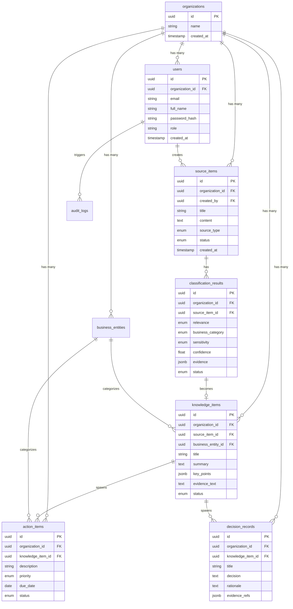
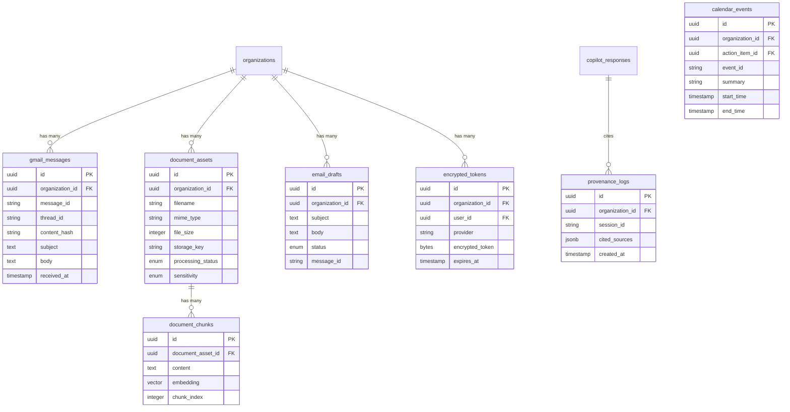

# KnowAct 系统架构文档

## 📋 目录

1. [系统概览](#系统概览)
2. [整体架构图](#整体架构图)
3. [技术栈](#技术栈)
4. [前端架构](#前端架构)
5. [后端架构](#后端架构)
6. [数据库架构](#数据库架构)
7. [外部集成](#外部集成)
8. [安全架构](#安全架构)
9. [部署架构](#部署架构)

---

## 系统概览

KnowAct 是一个 **AI 辅助的知识管理平台**，核心理念是：
- **所有 AI 输出都是建议（SUGGESTED）**，必须经过人工确认才能成为事实（CONFIRMED）
- **确认后的知识才能用于 Copilot 回答**，确保所有答案可追溯到经过验证的来源
- **多租户隔离**，每个 organization 的数据完全隔离（跨租户访问返回 404）

### 核心流程

```
收集 → 分类 → 确认 → 知识库 → Copilot 问答
  ↓      ↓      ↓        ↓         ↓
Inbox  AI建议  人工审核  向量检索   引用答案
```

---

## 整体架构图

```mermaid
graph TB
    %% 用户层
    subgraph Client["🖥️ 客户端层"]
        Browser["浏览器"]
        Mobile["移动端浏览器"]
    end

    %% 前端层
    subgraph Frontend["⚛️ 前端应用 (React SPA)"]
        AppShell["App Shell<br/>(导航 & 布局)"]
        
        subgraph Pages["页面组件"]
            Dashboard["Dashboard"]
            SourceInbox["Source Inbox"]
            Knowledge["Knowledge Hub"]
            Actions["Action Center"]
            Decisions["Decision Memory"]
            Copilot["Copilot Chat"]
            Gmail["Gmail Sync"]
            Calendar["Calendar"]
            Documents["Documents"]
            EmailDrafts["Email Drafts"]
            Privacy["Privacy & Data"]
            Integrations["Integrations"]
        end
        
        subgraph FrontendCore["核心模块"]
            AuthContext["认证上下文"]
            APIClient["API 客户端"]
            Router["路由管理"]
        end
    end

    %% API 网关
    Gateway["🌐 API Gateway<br/>(FastAPI)"]

    %% 后端核心引擎
    subgraph Backend["🔧 后端服务"]
        subgraph CoreEngine["Core Engine (核心引擎)"]
            AuthRouter["Auth Router<br/>(登录/注销)"]
            SourceRouter["Source Items Router<br/>(来源管理)"]
            KnowledgeRouter["Knowledge Router<br/>(知识管理)"]
            ActionsRouter["Actions Router<br/>(任务管理)"]
            DecisionsRouter["Decisions Router<br/>(决策记录)"]
            BriefsRouter["Briefs Router<br/>(简报)"]
            AuditRouter["Audit Router<br/>(审计日志)"]
            BizEntRouter["Business Entities Router<br/>(业务实体)"]
        end
        
        subgraph CoreServices["Core Services"]
            IngestionSvc["Ingestion Service<br/>(内容摄取)"]
            ClassificationSvc["Classification Service<br/>(AI 分类)"]
            KnowledgeSvc["Knowledge Service<br/>(知识处理)"]
            ActionSvc["Action Service<br/>(任务处理)"]
            DecisionSvc["Decision Service<br/>(决策处理)"]
            BriefSvc["Brief Service<br/>(简报生成)"]
            AuditSvc["Audit Service<br/>(审计追踪)"]
            AIProvider["AI Provider<br/>(OpenAI 抽象)"]
        end

        subgraph CWIModule["CWI Module (Connected Workspace Intelligence)"]
            GoogleAuthRouter["Google Auth Router<br/>(OAuth 流程)"]
            GmailRouter["Gmail Router<br/>(邮件同步)"]
            CalendarRouter["Calendar Router<br/>(日历集成)"]
            DocumentsRouter["Documents Router<br/>(文档上传)"]
            CopilotRouter["Copilot Router<br/>(AI 对话)"]
            EmailDraftRouter["Email Draft Router<br/>(邮件草稿)"]
            PrivacyRouter["Privacy Router<br/>(隐私设置)"]
            IntegrationsRouter["Integrations Router<br/>(集成管理)"]
        end
        
        subgraph CWIServices["CWI Services"]
            GoogleOAuth["Google OAuth Service<br/>(认证管理)"]
            GmailClient["Gmail Client<br/>(Gmail API)"]
            GmailSync["Gmail Sync Service<br/>(邮件同步)"]
            CalendarClient["Calendar Client<br/>(Calendar API)"]
            CalendarSvc["Calendar Service<br/>(日历操作)"]
            DocumentSvc["Document Service<br/>(文档处理)"]
            DocumentParsing["Document Parsing<br/>(文档解析)"]
            EmbeddingSvc["Embedding Service<br/>(向量嵌入)"]
            RetrievalSvc["Retrieval Service<br/>(向量检索)"]
            CopilotSvc["Copilot Service<br/>(对话生成)"]
            EmailDraftSvc["Email Draft Service<br/>(草稿生成)"]
            PrivacySvc["Privacy Service<br/>(数据控制)"]
            TokenVault["Token Vault<br/>(加密存储)"]
            Storage["Storage Backend<br/>(文件存储)"]
        end
    end

    %% 数据库层
    subgraph Database["🗄️ 数据库层"]
        PostgreSQL["PostgreSQL 16<br/>+ pgvector"]
        
        subgraph CoreTables["核心数据表"]
            OrgTable["organizations<br/>(租户)"]
            UserTable["users<br/>(用户)"]
            SourceTable["source_items<br/>(来源项)"]
            ClassTable["classification_results<br/>(分类结果)"]
            KnowTable["knowledge_items<br/>(知识项)"]
            ActionTable["action_items<br/>(任务项)"]
            DecisionTable["decision_records<br/>(决策记录)"]
            BizEntTable["business_entities<br/>(业务实体)"]
            AuditTable["audit_logs<br/>(审计日志)"]
        end
        
        subgraph CWITables["CWI 数据表"]
            GmailTable["gmail_messages<br/>(Gmail 消息)"]
            CalEventTable["calendar_events<br/>(日历事件)"]
            DocAssetTable["document_assets<br/>(文档资产)"]
            DocChunkTable["document_chunks<br/>(文档分块)"]
            EmailDraftTable["email_drafts<br/>(邮件草稿)"]
            ProvenanceTable["provenance_logs<br/>(来源日志)"]
            TokenTable["encrypted_tokens<br/>(加密令牌)"]
        end
    end

    %% 外部服务
    subgraph External["☁️ 外部服务"]
        OpenAI["OpenAI API<br/>(GPT + Embeddings)"]
        GoogleAPIs["Google APIs"]
        GmailAPI["Gmail API"]
        CalendarAPI["Calendar API"]
        GoogleOAuthAPI["Google OAuth 2.0"]
    end

    %% 连接关系 - 用户到前端
    Browser --> AppShell
    Mobile --> AppShell
    
    %% 前端内部连接
    AppShell --> Pages
    Pages --> AuthContext
    Pages --> APIClient
    AuthContext --> APIClient
    APIClient --> Router
    
    %% 前端到后端
    APIClient -->|HTTPS + JWT Cookie| Gateway
    
    %% API Gateway 路由分发
    Gateway --> CoreEngine
    Gateway --> CWIModule
    
    %% Core Engine 内部
    AuthRouter --> IngestionSvc
    SourceRouter --> IngestionSvc
    SourceRouter --> ClassificationSvc
    KnowledgeRouter --> KnowledgeSvc
    ActionsRouter --> ActionSvc
    DecisionsRouter --> DecisionSvc
    BriefsRouter --> BriefSvc
    AuditRouter --> AuditSvc
    
    %% Core Services 依赖
    ClassificationSvc --> AIProvider
    BriefSvc --> AIProvider

    %% CWI Module 内部
    GoogleAuthRouter --> GoogleOAuth
    GmailRouter --> GmailSync
    CalendarRouter --> CalendarSvc
    DocumentsRouter --> DocumentSvc
    CopilotRouter --> CopilotSvc
    EmailDraftRouter --> EmailDraftSvc
    PrivacyRouter --> PrivacySvc
    
    %% CWI Services 依赖
    GoogleOAuth --> TokenVault
    GmailSync --> GmailClient
    GmailSync --> IngestionSvc
    CalendarSvc --> CalendarClient
    DocumentSvc --> DocumentParsing
    DocumentSvc --> EmbeddingSvc
    DocumentSvc --> Storage
    EmbeddingSvc --> AIProvider
    CopilotSvc --> RetrievalSvc
    CopilotSvc --> AIProvider
    RetrievalSvc --> EmbeddingSvc
    EmailDraftSvc --> AIProvider
    
    %% 后端到数据库
    IngestionSvc --> SourceTable
    ClassificationSvc --> ClassTable
    KnowledgeSvc --> KnowTable
    ActionSvc --> ActionTable
    DecisionSvc --> DecisionTable
    AuditSvc --> AuditTable
    BriefSvc --> KnowTable
    
    GmailSync --> GmailTable
    CalendarSvc --> CalEventTable
    DocumentSvc --> DocAssetTable
    DocumentSvc --> DocChunkTable
    EmailDraftSvc --> EmailDraftTable
    CopilotSvc --> ProvenanceTable
    TokenVault --> TokenTable

    %% 租户隔离
    OrgTable -.->|FK: organization_id| UserTable
    OrgTable -.->|FK: organization_id| SourceTable
    OrgTable -.->|FK: organization_id| KnowTable
    OrgTable -.->|FK: organization_id| ActionTable
    
    %% 后端到外部服务
    AIProvider -->|API 调用| OpenAI
    GmailClient -->|API 调用| GmailAPI
    CalendarClient -->|API 调用| CalendarAPI
    GoogleOAuth -->|OAuth 流程| GoogleOAuthAPI
    
    %% 样式定义
    classDef frontend fill:#61dafb,stroke:#333,stroke-width:2px,color:#000
    classDef backend fill:#68a063,stroke:#333,stroke-width:2px,color:#fff
    classDef database fill:#336791,stroke:#333,stroke-width:2px,color:#fff
    classDef external fill:#ff6b6b,stroke:#333,stroke-width:2px,color:#fff
    
    class AppShell,Pages,FrontendCore frontend
    class CoreEngine,CoreServices,CWIModule,CWIServices backend
    class PostgreSQL,CoreTables,CWITables database
    class OpenAI,GoogleAPIs,GmailAPI,CalendarAPI,GoogleOAuthAPI external
```



---

## 技术栈

### 前端

| 技术 | 版本 | 用途 |
|------|------|------|
| **React** | 18 | UI 框架 |
| **TypeScript** | 5.x | 类型安全 |
| **Vite** | 5.x | 构建工具 |
| **Tailwind CSS** | 3.x | 样式框架 |
| **React Router** | 6.x | 客户端路由 |
| **Axios** | 1.x | HTTP 客户端 |

### 后端

| 技术 | 版本 | 用途 |
|------|------|------|
| **Python** | 3.13 | 编程语言 |
| **FastAPI** | 0.115+ | Web 框架 |
| **SQLAlchemy** | 2.x | ORM |
| **Alembic** | 1.x | 数据库迁移 |
| **Pydantic** | 2.x | 数据验证 |
| **PyJWT** | 2.x | JWT 认证 |
| **Cryptography (Fernet)** | 43+ | 令牌加密 |
| **pytest** | 8.x | 测试框架 |
| **Hypothesis** | 6.x | 属性测试 |

### 数据库

| 技术 | 版本 | 用途 |
|------|------|------|
| **PostgreSQL** | 16 | 关系数据库 |
| **pgvector** | 0.5+ | 向量存储与检索 |

### 外部服务

| 服务 | 用途 |
|------|------|
| **OpenAI GPT** | AI 分类、简报生成、Copilot 对话 |
| **OpenAI Embeddings** | text-embedding-3-small (文档向量化) |
| **Google OAuth 2.0** | 用户身份认证 |
| **Gmail API** | 邮件同步与发送 |
| **Google Calendar API** | 日历事件创建 |

---

## 前端架构

### 目录结构

```
frontend/src/
├── api/                    # API 客户端层
│   ├── client.ts          # Axios 配置
│   ├── auth.ts            # 认证 API
│   ├── sourceItems.ts     # 来源项 API
│   ├── knowledge.ts       # 知识 API
│   ├── actions.ts         # 任务 API
│   ├── decisions.ts       # 决策 API
│   ├── copilot.ts         # Copilot API
│   ├── gmail.ts           # Gmail API
│   ├── calendar.ts        # 日历 API
│   ├── documents.ts       # 文档 API
│   ├── emailDrafts.ts     # 邮件草稿 API
│   └── ...
├── auth/                  # 认证模块
│   ├── AuthProvider.tsx   # 认证上下文提供者
│   ├── AuthContext.ts     # 认证上下文
│   ├── ProtectedRoute.tsx # 路由守卫
│   └── useAuth.ts         # 认证 Hook
├── components/            # 可复用组件
│   ├── SuggestionCard.tsx # 建议卡片
│   ├── EvidenceBadge.tsx  # 证据徽章
│   └── ...
├── layouts/              # 布局组件
│   └── AppShell.tsx      # 应用外壳 (侧边栏 + 导航)
├── pages/                # 页面组件
│   ├── SourceInboxPage.tsx      # 来源收件箱
│   ├── KnowledgeHubPage.tsx     # 知识中心
│   ├── ActionCenterPage.tsx     # 任务中心
│   ├── DecisionMemoryPage.tsx   # 决策记忆
│   ├── CopilotPage.tsx          # Copilot 对话
│   ├── GmailSyncPage.tsx        # Gmail 同步
│   ├── DocumentsPage.tsx        # 文档管理
│   ├── EmailDraftsPage.tsx      # 邮件草稿
│   ├── PrivacyPage.tsx          # 隐私设置
│   └── ...
├── App.tsx               # 根组件 + 路由配置
└── main.tsx             # 应用入口
```

### 路由结构

| 路径 | 页面 | 功能 |
|------|------|------|
| `/` | Dashboard | 仪表盘 |
| `/source-inbox` | Source Inbox | 来源收件箱 (分类待处理项) |
| `/knowledge` | Knowledge Hub | 已确认知识库 |
| `/actions` | Action Center | 任务中心 |
| `/decisions` | Decision Memory | 决策记录 |
| `/copilot` | Copilot | AI 对话助手 |
| `/gmail` | Gmail Sync | Gmail 同步管理 |
| `/documents` | Documents | 文档上传与检索 |
| `/email-drafts` | Email Drafts | AI 生成的邮件草稿 |
| `/integrations` | Integrations | 第三方集成管理 |
| `/privacy` | Privacy & Data | 隐私与数据控制 |

---

## 后端架构

### 模块划分

```
backend/app/
├── core/                          # 核心引擎
│   ├── models.py                 # 核心数据模型
│   ├── schemas.py                # Pydantic 模式
│   ├── routers/                  # API 路由
│   │   ├── auth.py              # 认证路由
│   │   ├── source_items.py      # 来源项路由
│   │   ├── knowledge.py         # 知识路由
│   │   ├── actions.py           # 任务路由
│   │   ├── decisions.py         # 决策路由
│   │   ├── briefs.py            # 简报路由
│   │   ├── audit.py             # 审计路由
│   │   └── business_entities.py # 业务实体路由
│   └── services/                # 业务逻辑
│       ├── ingestion_service.py       # 内容摄取
│       ├── classification_service.py   # AI 分类
│       ├── knowledge_service.py       # 知识处理
│       ├── action_service.py          # 任务处理
│       ├── decision_service.py        # 决策处理
│       ├── brief_service.py           # 简报生成
│       ├── audit_service.py           # 审计追踪
│       └── ai_provider.py             # OpenAI 抽象
│
├── modules/cwi/                  # Connected Workspace Intelligence
│   ├── models.py                # CWI 数据模型
│   ├── schemas.py               # CWI Pydantic 模式
│   ├── routers/                 # CWI API 路由
│   │   ├── google_auth.py      # Google OAuth 路由
│   │   ├── gmail.py            # Gmail 路由
│   │   ├── calendar.py         # 日历路由
│   │   ├── documents.py        # 文档路由
│   │   ├── copilot.py          # Copilot 路由
│   │   ├── email_drafts.py     # 邮件草稿路由
│   │   ├── privacy.py          # 隐私路由
│   │   └── integrations.py     # 集成路由
│   └── services/                # CWI 业务逻辑
│       ├── google_oauth.py            # Google 认证
│       ├── gmail_client.py            # Gmail API 客户端
│       ├── gmail_sync_service.py      # Gmail 同步
│       ├── calendar_client.py         # Calendar API 客户端
│       ├── calendar_service.py        # 日历服务
│       ├── document_service.py        # 文档处理
│       ├── document_parsing.py        # 文档解析
│       ├── embedding.py               # 向量嵌入
│       ├── retrieval_service.py       # 向量检索
│       ├── copilot_service.py         # Copilot 对话
│       ├── email_draft_service.py     # 邮件草稿
│       ├── privacy_service.py         # 隐私控制
│       ├── token_vault.py             # 令牌加密存储
│       └── storage.py                 # 文件存储后端
│
├── config.py                    # 配置管理
├── database.py                  # 数据库连接
├── security.py                  # 密码哈希、JWT
├── dependencies.py              # FastAPI 依赖注入
├── main.py                      # 应用入口
└── seed.py                      # 种子数据
```

---

### API 路由结构

| 路由前缀 | 功能模块 | 主要端点 |
|---------|---------|---------|
| `/api/auth` | 认证 | `POST /login`, `POST /logout`, `GET /me` |
| `/api/source-items` | 来源项 | `GET /`, `POST /`, `PATCH /{id}` |
| `/api/classifications` | 分类结果 | `POST /classify`, `PATCH /{id}/confirm` |
| `/api/knowledge` | 知识库 | `GET /`, `POST /`, `PATCH /{id}` |
| `/api/actions` | 任务 | `GET /`, `POST /`, `PATCH /{id}` |
| `/api/decisions` | 决策 | `GET /`, `POST /`, `PATCH /{id}` |
| `/api/briefs` | 简报 | `POST /generate` |
| `/api/audit` | 审计日志 | `GET /` |
| `/api/business-entities` | 业务实体 | `GET /`, `POST /` |
| `/api/google/auth` | Google OAuth | `GET /url`, `GET /callback` |
| `/api/gmail` | Gmail 同步 | `POST /sync`, `GET /messages` |
| `/api/calendar` | 日历 | `POST /events` |
| `/api/documents` | 文档 | `POST /upload`, `GET /`, `GET /{id}` |
| `/api/copilot` | Copilot | `POST /ask` |
| `/api/email-drafts` | 邮件草稿 | `POST /generate`, `POST /{id}/send` |
| `/api/privacy` | 隐私控制 | `GET /settings`, `DELETE /data` |
| `/api/integrations` | 集成管理 | `GET /status`, `DELETE /disconnect` |

---

## 数据库架构

### 核心数据模型 (Core Engine)



---

### CWI 数据模型 (Connected Workspace Intelligence)



---
